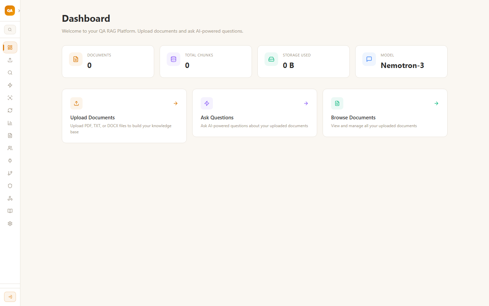
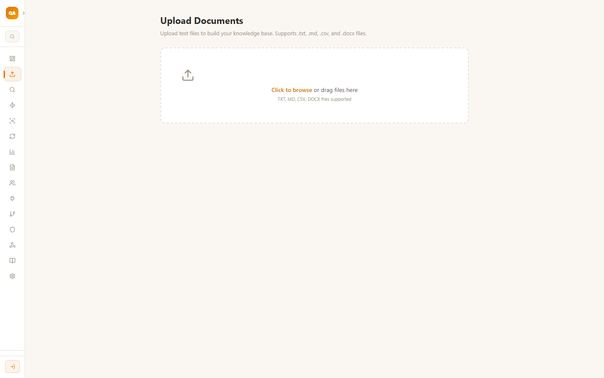
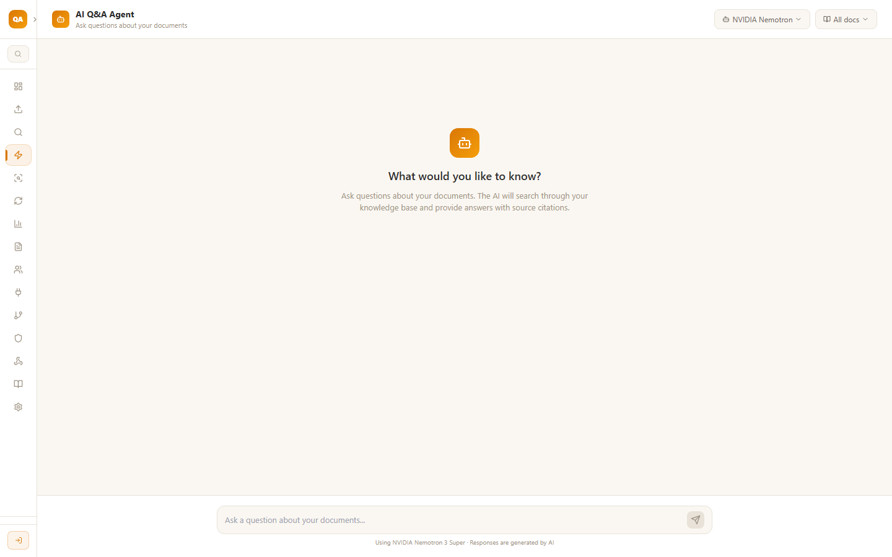
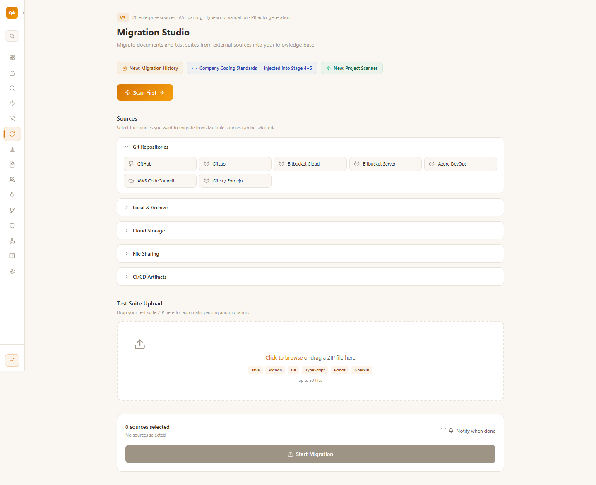
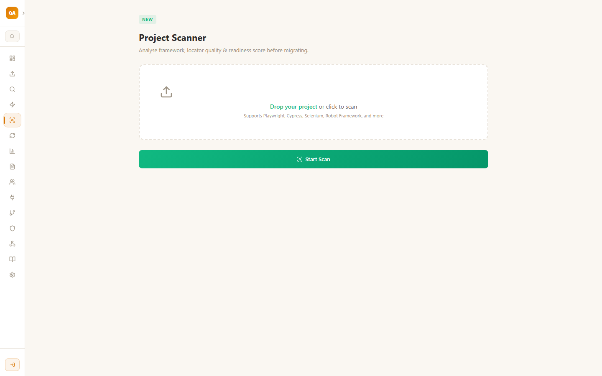
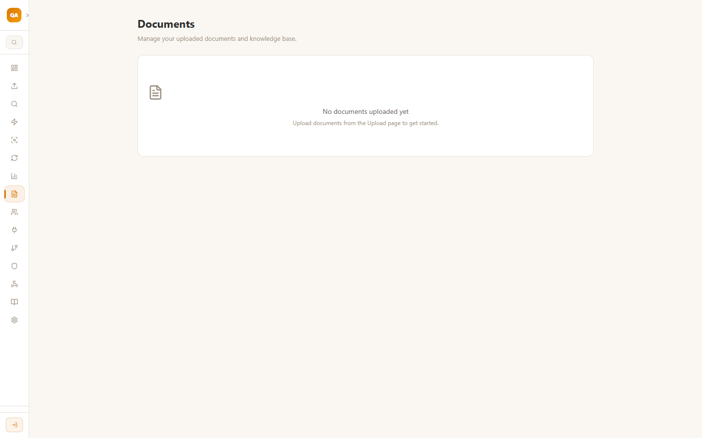

# QA RAG Platform

A Retrieval-Augmented Generation (RAG) application that lets you upload documents and ask AI-powered questions about their content. Built with Next.js 14, OpenRouter free models, and Pinecone for vector search.

## Screenshots

| Dashboard | Upload Documents |
|---|---|
|  |  |

| AI Q&A Agent | Migration Studio |
|---|---|
|  |  |

| Project Scanner | Documents Manager |
|---|---|
|  |  |

## Features

- **Document Upload** — Upload `.txt`, `.md`, `.csv`, and `.docx` files via drag-and-drop
- **Smart Chunking** — Documents are split into character-based chunks (configurable size) with overlap for context preservation
- **AI Q&A** — Ask questions about your documents and get answers with source citations using RAG
- **Model Selection** — Choose from 7+ free OpenRouter models (Nemotron, Llama, Qwen, Gemma, etc.)
- **Configurable Embeddings** — Switch between free prompt-based embeddings or dedicated models like `text-embedding-3-small`
- **Vector Search** — In-memory cosine similarity (free) or Pinecone (persistent, for production/serverless)
- **Dashboard** — Live stats on documents, chunks, and storage
- **Migration Studio** — Import test suites from 20+ enterprise sources (Git, CI/CD, cloud storage)
- **Project Scanner** — Analyze framework, locator quality, and readiness before migration

## Tech Stack

| Layer | Choice |
|---|---|
| Framework | Next.js 14 (App Router) |
| Language | TypeScript 5 (strict) |
| UI | React 18 + inline styles with CSS variables |
| Icons | Lucide React |
| AI Provider | OpenRouter API |
| Embeddings | Prompt-based (free) or text-embedding-3-small |
| Vector Store | In-memory (default) or Pinecone |
| Document Store | In-memory or Pinecone-backed (for serverless) |
| DOCX Parsing | Mammoth |

## Getting Started

### Prerequisites

- Node.js 18+
- An [OpenRouter](https://openrouter.ai) API key (free tier works)

### Installation

```bash
git clone https://github.com/your-username/qaragplatform.git
cd qaragplatform
npm install
cp .env.example .env.local
```

Edit `.env.local` with your keys:

```env
OPENROUTER_API_KEY=sk-or-v1-your-key-here
EMBEDDING_MODEL=prompt
```

For persistent storage across restarts (recommended for production):

```env
EMBEDDING_MODEL=openai/text-embedding-3-small
PINECONE_API_KEY=pcsk_...
PINECONE_INDEX=rag-embeddings
```

### Run

```bash
npm run dev
```

Open [http://localhost:3000](http://localhost:3000).

## Configuration

| Env Variable | Default | Description |
|---|---|---|
| `OPENROUTER_API_KEY` | — | Required for all AI features |
| `EMBEDDING_MODEL` | `prompt` | `prompt` (free) or any OpenRouter embedding model ID |
| `PINECONE_API_KEY` | — | Set to use Pinecone instead of in-memory vector store |
| `PINECONE_INDEX` | `rag-embeddings` | Pinecone index name (dimension 1536, cosine metric) |
| `NEXT_PUBLIC_DEFAULT_MODEL` | Nemotron-3 Super | Default chat model |

## Project Structure

```
app/          # Next.js App Router (pages + API routes)
  ai/         # AI Q&A chat interface
  upload/     # Document upload
  documents/  # Document manager
  migration/  # Migration Studio
  scanner/    # Project Scanner
  settings/   # API key & model config
  api/        # Backend endpoints (chat, upload, documents, migration)
lib/          # Core libraries
  openrouter.ts     # OpenRouter chat API
  embeddings.ts     # Embedding abstraction (prompt or API-based)
  vector-store.ts   # Vector store abstraction (in-memory or Pinecone)
  rag.ts            # RAG pipeline (chunking, retrieval, Q&A)
  document-store.ts # Document metadata storage
components/   # Shared UI components
```

## License

MIT
